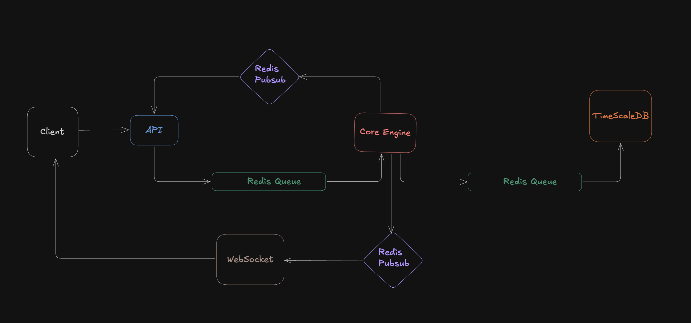
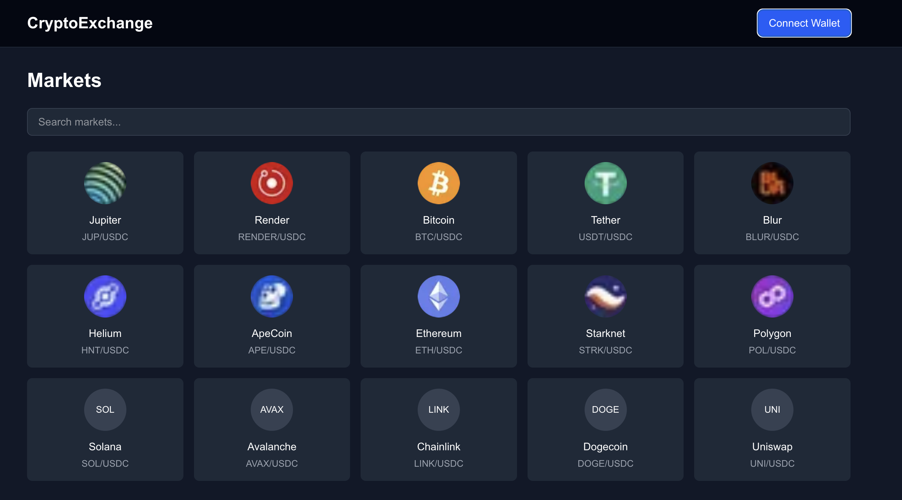
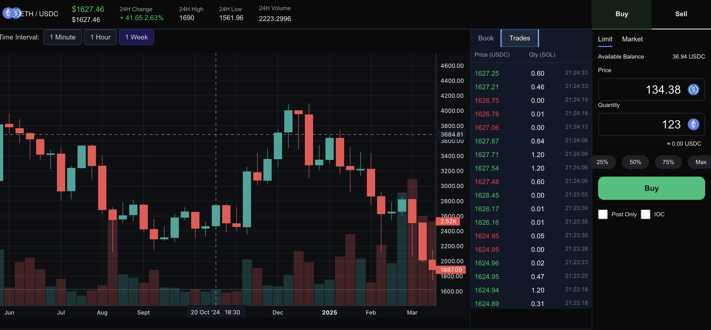
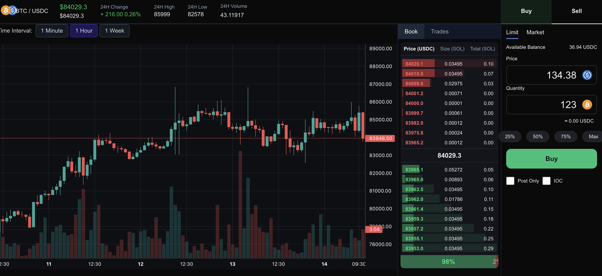

# 📈 Stock Exchange Web Application using TimescaleDB

A real-time stock trading and analysis platform built using modern technologies like TimescaleDB, Redis, WebSockets, and React. Inspired by professional platforms such as Binance, the application enables efficient trading, live order book management, and real-time charting with low-latency performance.

## 👥 Developed By — Group *SQLite*
### 🧑‍💻 Team Members
- **Tuhin Mondal** — `22CS10087`
- **Diganta Mandal** — `22CS30062`
- **Antik Sur** — `22CS10085`
---

## 🚀 Features

- **📊 Real-Time Order Book:** Displays live bid/ask levels with prices, volumes, and types.
- **📈 Candlestick & Volume Charts:** Aggregated and rendered using TimescaleDB and TradingView charts.
- **💰 Buy/Sell Interface:** Market, limit, and stop order placement with live status tracking.
- **📡 WebSockets for Live Updates:** Real-time trades, price updates, and order book changes.
- **📉 Dashboard:** Advanced UI with dynamic charts, trade feeds, and order management tools.

---

## 🏗️ System Architecture

### 🔧 Backend Modules

- REST API (Node + Express)
- Order Matching Engine
- Redis Queues and Pub/Sub
- WebSockets Server
- TimescaleDB for persistent storage

### ⚙️ Backend Architecture

The system follows a two-tiered architecture inspired by memory hierarchies — combining Redis for fast, in-memory processing and TimescaleDB for durable, historical storage.



---

## 🖼️ UI Screenshots

### 🏠 Home Page



### 📉 Trades + Candlestick Chart + Volume



### 📘 Order Book View



---

## 🛠️ Tech Stack

### ⚙ Backend

- **Node.js + Express** – API server
- **Redis** – In-memory store for pub/sub & queues
- **TimescaleDB** – Time-series DB built on PostgreSQL
- **WebSockets** – Live updates to clients
- **Docker** – Containerized deployment

### 🎨 Frontend

- **Next.js + React** – Dynamic SSR and component rendering
- **Tailwind CSS** – Utility-first styling
- **shadcn/UI** – Beautiful UI components
- **lightweight-charts** – Financial chart rendering

---

## 🧪 TimescaleDB Features in Use

- Hypertables for time-partitioned stock data
- Continuous Aggregation for candlesticks (1m/1h/1w)
- Fast, scalable time-windowed queries
- Historical data compression & analysis

---

## 📡 WebSocket Use-Cases

- Live price updates
- Instant order book sync
- Streaming recent trades
- Real-time candlestick/volume chart updates

---

## 📌 Future Scope

- ✅ Portfolio management module
- 📢 Real-time alerts (push/email/SMS)
- 🤖 ML-based anomaly detection and trend prediction
- 🧩 Distributed matching engine for large-scale deployment

---

## 📚 References

- [TimescaleDB Docs](https://docs.timescale.com/)
- [Redis Pub/Sub](https://redis.io/docs/latest/develop/interact/pubsub/)
- [Binance API](https://www.binance.com/en-IN/binance-api)
- [WebSocket API](https://developer.mozilla.org/en-US/docs/Web/API/WebSocket)
- [lightweight-charts](https://www.tradingview.com/chart/)
- [Next.js Docs](https://nextjs.org/docs)
- [Docker Compose Docs](https://docs.docker.com/compose/install/)

---

## 🧭 Setup & Run

Below are quick, practical steps to get the main services running locally for development. The repo is organized into multiple independent packages (frontend, backend, proxy, etc.); each one follows the same pattern: install dependencies, provide any required environment variables, then run the dev/start script.

Prerequisites
- Node.js (v18+ recommended)
- npm, yarn, or pnpm
- Docker & docker-compose (recommended to run Redis and TimescaleDB locally)

Start required infrastructure (Redis, Postgres/TimescaleDB)
1. From the repository root, bring up DB services defined under `db/docker` (if you use them):

```bash
cd db/docker
docker compose up -d
```

2. Verify Redis is available on port 6379 (or set the host/port in each service's env).

Run the backend (Exchange API)
1. Change into the backend API folder, install packages, and run the dev script:

```bash
cd exchange-backend/api
npm install
npm run dev
```

Note: the `dev` script runs a TypeScript build and then starts the compiled Node app (`npm run build && npm run start`).

Run the frontend (Next.js)
1. From the project root:

```bash
cd exchange-frontend
npm install
npm run dev
```

Open http://localhost:3000 in your browser (Next.js default).

Run the proxy (optional)
1. The proxy is a lightweight Node server. Start it with Node directly:

```bash
cd exchange-proxy
npm install
node index.js
```

Other services
- For other packages (for example `v2-backend`, `db`, `engine`, `ws`, `mm`) use the same pattern: `cd <folder>`, `npm install`, then `npm run dev` (or `node index.js` if no script is provided).

Environment variables
- Some services expect `.env` files or environment variables (Redis URL, Postgres connection). If an `.env.example` exists in a package, copy it and edit the values:

```bash
cp .env.example .env
# then edit .env to set DB/Redis credentials
```
---

## 📄 License

This project is for educational and demonstration purposes. Contact the authors for reuse or extension.
